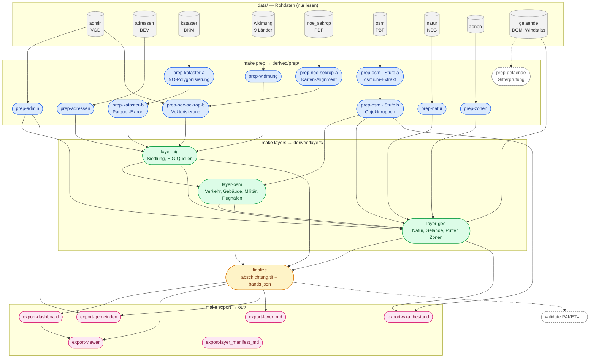
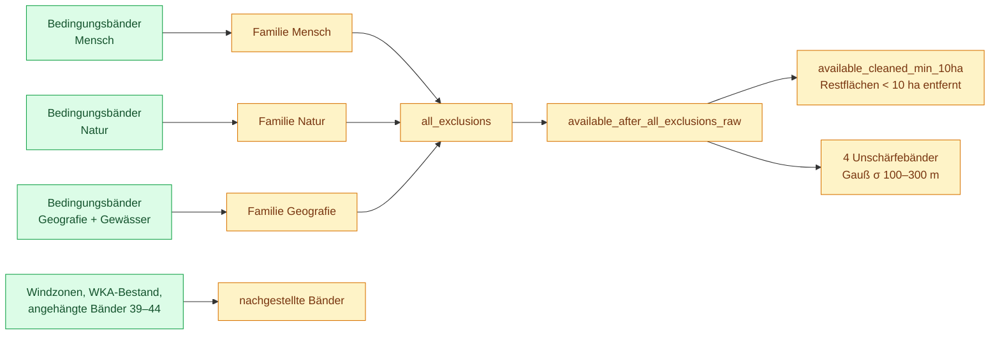

# Workflow

Wie `make` aus den Rohdaten unter `data/` das 44-Band-GeoTIFF und die
Exportprodukte unter `out/` baut. Ergänzt [`BETRIEB.md`](BETRIEB.md) um den
Abhängigkeitsgraphen; der eingefrorene Altgraph unter
[`dataflow/`](dataflow/README.md) beschreibt die Kette vor Welle 6 und gilt
hier nicht.

## Das Prinzip

Fünf Stufen, jede liest nur aus der vorigen:

```
data/  →  derived/prep/  →  derived/layers/  →  out/abschichtung.tif  →  out/…
 Roh       Prep               Layer               Finalize                Export
```

`make` (= `make all`) ruft `prep → layers → finalize → export` nacheinander
auf. Jedes Ziel ist ein `uv run python -m pipeline.<stufe>.<domäne>` und steht
in einer eigenen Datei `make/<stufe>/<domäne>.mk`.

## Der Graph

Jeder Kasten ist ein Make-Ziel, jeder Pfeil heißt „liest die Ausgabe von".
Gestrichelt: optional oder nur Prüfung, kein Datenfluss in das Ergebnis.



Zwei Pfeile überspringen eine Stufe, beide bewusst:

- **`gelaende` → `layer-geo`:** DGM und Windatlas liegen schon im Zielgitter.
  `prep-gelaende` prüft nur das Gitter und schreibt einen Prüfbericht, keine
  Ableitung; `layer-geo` liest die Rohraster direkt.
- **`adressen` → `layer-hig`:** neben der Prep-Ausgabe liest `layer-hig` das
  Adressverzeichnis aus `data/` (`--address-dir`).

`export-layer_manifest_md` kopiert nur `docs/LAYER-MANIFEST.md` nach `out/`
und hängt an keinem anderen Ziel.

## Die Stufen

### Prep — `derived/prep/`

Neun Domänen, drei davon zweistufig (`kataster`, `osm`, `noe_sekrop`): zwölf
Einzelschritte. `kataster` und `noe-sekrop` haben je ein eigenes Make-Ziel pro
Stufe (`-a`, `-b`); `prep-osm` führt beide Stufen in einem Aufruf aus. Jeder schreibt nach einem erfolgreichen Lauf einen
Fingerabdruck (`pipeline/fingerprint.py`) über seine Eingaben **und seinen
eigenen Quelltext** und überspringt sich beim nächsten Lauf, solange beides
unverändert ist. `prep-kataster-a` allein dauert 45–70 Minuten.

### Layer — `derived/layers/`

Drei Module schreiben zusammen 39 Checkpoint-Raster (Namen in
`pipeline/contract.py:LAYER_NAMES`). Die Reihenfolge ist fest, weil jedes die
Checkpoints des vorigen liest:

| Ziel | Schreibt |
|---|---|
| `layer-hig` | die sieben Siedlungsquellen: Wohnbauland, Ferienhaus/Tourismus, HiG-Widmung, NÖ-750-m-Zonen, Streusiedlungs-Hüllen, bewohnte Einzellagen, Nicht-Wohngebäude |
| `layer-osm` | Straßen, Bahn, Seilbahnen, Militär, Flughäfen samt Korridor, Gebäudequellen (inkl. der Rohbänder `general_buildings_roh_osm/_dkm`) |
| `layer-geo` | Puffer um die Quellen, Häuser-im-Grünen-Familie, Natur, Hangneigung, Höhe, Wind, Gewässer, amtliche Windzonen, WKA-Bestand, die drei Familiensummen `sources_*` |

Der Fingerabdruck dieser Stufe erfasst den Quelltext **nicht**: nach einer
Codeänderung in `pipeline/layers/` oder `calc/` vor dem Lauf `derived/layers/`
löschen, sonst entsteht ein TIF ohne die Änderung.

### Finalize — `out/abschichtung.tif`

`pipeline/finalize.py` liest alle Checkpoints und komponiert daraus in einem
Durchgang (rund drei Minuten):



Direkt danach schreibt `calc/band_manifest.py` das Sidecar
`out/abschichtung.bands.json` aus derselben Bandliste. TIF und Manifest
gehören zusammen (Vertrag: [`HANDOFF.md`](HANDOFF.md)).

### Export — `out/`

| Ziel | Liest | Schreibt |
|---|---|---|
| `export-dashboard` | TIF + Manifest | `out/dashboard/` (Leaflet, PNG je Band, `report.json`) |
| `export-viewer` | TIF + Manifest, Dashboard | Viewer im Dashboard-Ordner |
| `export-gemeinden` | TIF, `prep/admin` | `out/gemeinden.geojson` |
| `export-wka_bestand` | `prep/osm/b_layers`, Layer `official_wind_zoning` | `out/wka_bestand_punkte.geojson` |
| `export-layer_md` | Manifest | `out/LAYER.md` |
| `export-layer_manifest_md` | `docs/LAYER-MANIFEST.md` | `out/LAYER-MANIFEST.md` |

`finalize` und `export` haben keinen Fingerabdruck und laufen immer
vollständig.

### Validate — außerhalb der Kette

`make validate PAKET=<name>` vergleicht `out/abschichtung.tif` gegen die
Referenz-`sha256` und, bei Abweichung, bandweise gegen
`$ABSCHICHTUNG_RUN1`. Erzeugt kein Produkt und ist deshalb nicht Teil von
`make all` (siehe `make/validate/README.md`).

## Hinweise zum Ausführen

- **Einzelne Knoten** lassen sich direkt aufrufen, z. B. `make layer-geo`
  oder `make prep-kataster-b`. Make-seitig hängen nur `layer-osm` an
  `layer-hig`, `layer-geo` an beiden und `export-viewer` an
  `export-dashboard`. Alle übrigen Abhängigkeiten im Graphen sind **nicht**
  als Make-Voraussetzung erklärt: wer einen Knoten einzeln startet, muss
  dafür sorgen, dass dessen Eingaben schon gebaut sind.
- **Kein `make -j`** für `make all`: die Stufen verlassen sich auf die
  Reihenfolge `prep layers finalize export`, nicht auf Dateiabhängigkeiten.
- **Fehlende Rohdaten brechen nicht ab**, sondern liefern ein plausibles,
  aber falsches Ergebnis. Vor dem ersten Lauf
  [`rohdaten.md`](rohdaten.md), Abschnitt 0, lesen.
